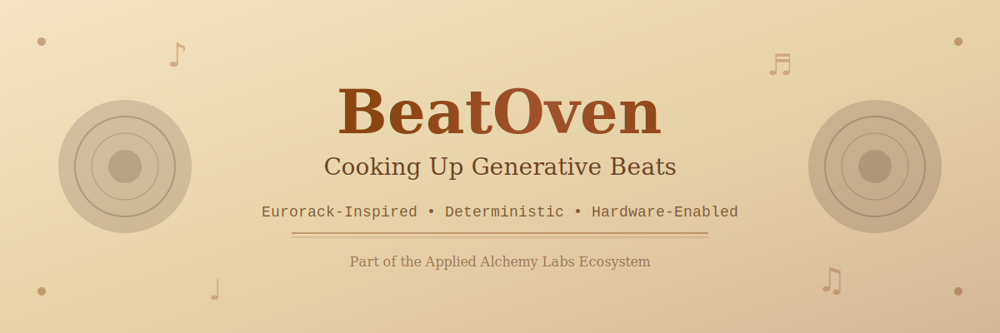

```
╔══════════════════════════════════════════════════════════════════════════════╗
║                                                                              ║
║   ██████╗ ███████╗ █████╗ ████████╗ ██████╗ ██╗   ██╗███████╗███╗   ██╗   ║
║   ██╔══██╗██╔════╝██╔══██╗╚══██╔══╝██╔═══██╗██║   ██║██╔════╝████╗  ██║   ║
║   ██████╔╝█████╗  ███████║   ██║   ██║   ██║██║   ██║█████╗  ██╔██╗ ██║   ║
║   ██╔══██╗██╔══╝  ██╔══██║   ██║   ██║   ██║╚██╗ ██╔╝██╔══╝  ██║╚██╗██║   ║
║   ██████╔╝███████╗██║  ██║   ██║   ╚██████╔╝ ╚████╔╝ ███████╗██║ ╚████║   ║
║   ╚═════╝ ╚══════╝╚═╝  ╚═╝   ╚═╝    ╚═════╝   ╚═══╝  ╚══════╝╚═╝  ╚═══╝   ║
║                                                                              ║
║              Modular Generative Music Engine + Hardware Bridge              ║
║                   Eurorack-Inspired • Deterministic • ABX-Core              ║
║                                                                              ║
╚══════════════════════════════════════════════════════════════════════════════╝
```

<div align="center">



</div>

<div align="center">

[](LICENSE)
[](https://www.python.org/downloads/)
[](https://fastapi.tiangolo.com/)
[](https://appliedalchemy.io/abx-core)
[](https://appliedalchemy.io/seed)

**Deterministic generative music with hardware integration, multi-modal intelligence, and binaural audio FX**

[Features](#-features) • [Quick Start](#-quick-start) • [Hardware Bridge](#-hardware-bridge-dspcoffee) • [Media Intelligence](#-media-intelligence) • [API](#-api-reference) • [Docs](#-documentation)

</div>

---

## 📋 Table of Contents

- [Overview](#-overview)
- [Features](#-features)
  - [Core Engine](#core-engine)
  - [Hardware Bridge (dsp.coffee)](#-hardware-bridge-dspcoffee)
  - [Media Intelligence](#-media-intelligence)
  - [Binaural Audio FX](#-binaural-audio-fx)
  - [Signal Intake](#signal-intake-system)
  - [Stem Extraction](#stem-extraction-service)
  - [Ringtone Generation](#ringtone--notification-generation)
  - [Mobile UI](#mobile-ui)
- [Quick Start](#-quick-start)
- [Installation Tiers](#-installation-tiers)
- [Architecture](#-architecture)
- [Usage Examples](#-usage-examples)
- [API Reference](#-api-reference)
- [Hardware Integration](#-hardware-integration)
- [Deployment](#-deployment)
- [Testing](#-testing)
- [Documentation](#-documentation)
- [Contributing](#-contributing)
- [License](#-license)

---

## 🎯 Overview

**BeatOven** is a Eurorack-inspired generative music system built on **ABX-Core v1.2** with complete hardware integration, multi-modal intelligence, and deterministic audio processing. Part of the **Applied Alchemy Labs (AAL)** ecosystem.

### What Makes BeatOven Unique?

- **🔌 Hardware Bridge**: Drive Eurorack modules (dsp.coffee) from software via UDP + Serial
- **🎬 Multi-Modal Intelligence**: Analyze images/video → extract emotion → generate music
- **🧠 Binaural Audio FX**: User-tunable frequency entrainment (Theta, Alpha, Beta, Gamma)
- **🎲 Deterministic**: Same inputs always produce identical outputs
- **📡 Progressive Enhancement**: Works basic → semantic → full depth based on installed deps
- **🔬 ABX-Core Hardened**: Structured, entropy-minimizing framework with provenance tracking

---

## ✨ Features

### Core Engine

<details open>
<summary><b>Click to expand core features</b></summary>

- **Modular Architecture**: Eurorack-inspired module system with PatchBay routing
- **Deterministic Generation**: Same inputs → identical outputs (SEED Protocol)
- **ABX-Core v1.2**: Structured, entropy-minimizing framework
- **GPU Acceleration**: CUDA and Apple Silicon (MPS) support
- **API-First**: FastAPI backend with OpenAPI documentation
- **AAL Interoperability**: Clean hooks for PsyFi, Phonomicon, Echotome

</details>

---

### 🔌 Hardware Bridge (dsp.coffee)

<details open>
<summary><b>Connect BeatOven to physical Eurorack modules</b></summary>

**Two-lane architecture** for reliable hardware control:

#### Lane A: Realtime (UDP)
- **Protocol**: OSC-compatible newline-delimited messages
- **Purpose**: Low-latency macro/param updates
- **Messages**: `/macro <preset_id> <name> <value>`, `/meta bpm <value>`
- **Latency**: <1ms

#### Lane B: Reliable Operations (Serial)
- **Protocol**: Length-prefixed CBOR frames with ACK
- **Purpose**: Scene changes, preset loads, pattern commits
- **Safety**: Automatic retries, quantized transitions, crossfades
- **Commands**: `LOAD_PRESET`, `STAGE_NEXT`, `COMMIT_PATTERN`, `PING`

#### ResonanceFrame Pipeline

```
Source                                    Bridge                Hardware
┌─────────────────┐                    ┌────────────────┐    ┌──────────┐
│ Abraxas Stream  │──┐                 │                │    │          │
│ (live music)    │  │                 │  Preset        │    │ dsp.     │
├─────────────────┤  ├─► ResonanceFrame├─► Selection    ├───►│ coffee   │
│ Structured      │  │   (8 metrics)   │  (scoring)     │    │ Hardware │
│ Input (API)     │  │                 │                │    │          │
├─────────────────┤  │                 │  Transport     │    │ UDP:9000 │
│ Media (img/vid) │──┘                 │  (UDP+Serial)  │    │ Serial   │
└─────────────────┘                    └────────────────┘    └──────────┘
```

#### Preset Selection

- **Genre/Subgenre Gating**: Hard filters for music style
- **Metric Scoring**: Weighted overlap with target ranges
- **Action Selection**: `NOOP`, `PARAM_NUDGE`, `SCENE_CHANGE`, `PATTERN_INJECT`
- **Thresholds**: Configurable confidence levels (default: 0.72, 0.88)

#### Example Usage

```python
from beatoven.dspcoffee_bridge import (
    BridgeRuntime, PresetRegistry,
    UdpRealtimeLane, SerialOpsLane
)
from beatoven.dspcoffee_bridge.example_preset_pack import PRESETS

# Setup bridge
registry = PresetRegistry(PRESETS)
rt_lane = UdpRealtimeLane(host="192.168.1.50", port=9000)
op_lane = SerialOpsLane(port="/dev/ttyACM0", baud=115200)

bridge = BridgeRuntime(
    presets=registry,
    realtime_lane=rt_lane,
    ops_lane=op_lane,
)

# Feed ResonanceFrame from any source
bridge.on_frame(resonance_frame)  # → Hardware responds!
```

**See**: [Hardware Integration](#-hardware-integration) for complete guide

</details>

---

### 🎬 Media Intelligence

<details open>
<summary><b>Analyze images/video → extract emotion → drive music</b></summary>

**Progressive enhancement architecture** with hot-swappable semantic providers:

#### Analysis Pipeline

```
Media Input → Physical Features → Semantic Providers → Affect Model → ResonanceFrame
   (img/vid)     (CV, deterministic)  (CLIP, Action, Audio)  (VAD + blends)   (8 metrics)
```

#### Three-Tier Enhancement

| Tier | Install | Providers | Latency | Use Case |
|------|---------|-----------|---------|----------|
| **Basic** | `[media]` | Physical only | 50-100ms | Orin Nano, basic desktop |
| **Semantic** | `+ torch transformers` | + CLIP | 250-500ms | Scene tags + era inference |
| **Full** | `[media-full]` | All 3 providers | 750ms | Desktop with GPU |

#### Physical Features (Deterministic, Always Available)

- **Color**: Brightness (luma), saturation, contrast
- **Texture**: Sharpness (Laplacian), edge density (Canny)
- **Composition**: Symmetry (L/R), clutter metrics
- **Motion** (video): Optical flow energy, jitter/shake

#### Semantic Providers (Hot-Swappable)

**1. CLIP Provider** (`clip`)
- **Model**: `openai/clip-vit-base-patch32` (~600MB)
- **Output**: Scene tags, era distribution (1990s-2020s)
- **Performance**: 200-400ms CPU, 50-100ms GPU
- **Dependencies**: `torch`, `transformers`, `pillow`

**2. Action Provider** (`action`)
- **Model**: R3D-18 (torchvision, ~200MB)
- **Output**: Top 5 video actions with probabilities
- **Performance**: 500-800ms CPU, 150-300ms GPU
- **Dependencies**: `torch`, `torchvision`

**3. Audio Mood Provider** (`audio_mood`)
- **Analysis**: Tempo, RMS, spectral centroid, rolloff, ZCR
- **Proxies**: Energy, brightness, percussive (normalized)
- **Performance**: 1-3s for 30s audio
- **Dependencies**: `librosa`, `soundfile`

#### Affect Model (VAD + Emotion Blends)

**Core Dimensions**:
- **Valence**: pleasant ↔ unpleasant [0,1]
- **Arousal**: calm ↔ intense [0,1]
- **Dominance**: submissive ↔ in-control [0,1]

**Emotion Blends**: Awe, dread, nostalgia, tenderness

#### Honest Availability Reporting

```json
{
  "providers": [
    {"name": "clip", "available": true, "version": "clip-vit-b32"},
    {"name": "action", "available": false, "reason": "No module named 'torchvision'"}
  ]
}
```

**UI Always Shows All Options**:
- Available providers: Enabled toggles
- Unavailable providers: Grayed out with install hint

#### Example Usage

```python
from beatoven.media_intel import analyze_image, media_to_resonance
from beatoven.media_intel.semantic_engine import SemanticEngine
from beatoven.media_intel.providers.clip_provider import ClipProvider

# Basic mode (fast, opencv only)
media_frame = analyze_image("photo.jpg", media_id="img_001")

# Semantic mode (richer)
engine = SemanticEngine(providers=[ClipProvider()])
media_frame = analyze_image("photo.jpg", media_id="img_001", semantic_engine=engine)

# Convert to ResonanceFrame
resonance_frame = media_to_resonance(media_frame)

# Feed to hardware bridge
bridge.on_frame(resonance_frame)  # → Music responds to visual emotion!
```

**See**: [Media Intelligence Guide](beatoven/media_intel/README.md) | [Providers Architecture](beatoven/media_intel/PROVIDERS.md)

</details>

---

### 🧠 Binaural Audio FX

<details open>
<summary><b>User-tunable frequency entrainment for renders and streams</b></summary>

**Binaural beats** for brain entrainment via inter-channel frequency differences:

#### Mechanism

- **Left channel**: `sin(2π × (carrier - beat/2) × t)`
- **Right channel**: `sin(2π × (carrier + beat/2) × t)`
- **Perceived beat**: Brain perceives `beat_hz` due to frequency difference

#### Frequency Ranges

| Range | Hz | State | Use Case |
|-------|----|----|----------|
| **Theta** | 4-8 Hz | Deep meditation, creativity | Meditation tracks |
| **Alpha** | 8-13 Hz | Relaxation, flow | Focus work |
| **Beta** | 13-30 Hz | Active thinking, alertness | Studying |
| **Gamma** | 30-40 Hz | Peak cognition, insight | Creative sessions |

#### Parameters

```python
BinauralSpec(
    carrier_hz=200.0,   # 80-1000 Hz (base frequency)
    beat_hz=6.0,        # 0.5-40 Hz (entrainment frequency)
    mix=0.15,           # 0-1 (dry/wet blend)
    ramp_s=2.0,         # Fade in/out duration
    phase_deg=0.0,      # Phase offset
    pan=0.0,            # -1 to 1 (L/R bias)
)
```

#### Applications

- **Render FX**: Apply to final audio exports
- **Stream FX**: Real-time processing during playback
- **Per-Section**: Different specs for intro/build/drop/outro

#### Example Usage

```python
from beatoven.audio_fx import BinauralSpec, apply_binaural
import numpy as np

# Load stereo audio (N,2)
stereo = load_audio("render.wav")

# Apply theta wave (meditation)
spec = BinauralSpec(
    carrier_hz=200.0,
    beat_hz=6.0,      # Theta range
    mix=0.20,
    ramp_s=3.0,
)
output = apply_binaural(stereo, sr=44100, spec=spec)

# Save
save_audio("render_binaural.wav", output)
```

**Preview API**: `POST /api/fx/binaural/preview` returns base64 WAV for testing

</details>

---

### Signal Intake System

<details>
<summary><b>Multi-source data ingestion with symbolic interpretation</b></summary>

- **30+ Source Categories**: World news, tech, AI/ML, sports, markets, culture, science
- **Multi-Format**: RSS/Atom, JSON APIs, HTML, text, PDFs, epub, ICS, tasks
- **Unified Schema**: All inputs → `SignalDocument` format
- **Symbolic Mapping**: Auto-extract resonance, density, tension, emotional index
- **Provenance**: SHA-256 hashing for all signals
- **Background Polling**: Configurable intervals with caching

</details>

---

### Stem Extraction Service

<details>
<summary><b>ML-based audio separation with emotional analysis</b></summary>

- **ML Models**: Demucs, Spleeter (PyTorch, JAX, ONNX)
- **Stem Types**: Drums, bass, vocals, guitar, piano, strings, brass, wind, synth, FX
- **Multi-Format**: WAV, FLAC, AIFF, ALAC, MP3, AAC, M4A, OGG, Opus
- **High-Res**: 44.1kHz–192kHz, 16–32 bit depth
- **Emotional Analysis**: Auto-compute resonance, density, tension per stem
- **Pure Extraction**: No reinterpretation, preserves original audio

</details>

---

### Ringtone & Notification Generation

<details>
<summary><b>Short-form audio optimized for mobile</b></summary>

- **Three Modes**: Notification (1-5s), Short Ringtone (10-15s), Standard (20-30s)
- **Configurable**: Melodic/percussive toggles, intensity, looping
- **Mobile Formats**: M4R (iOS), MP3 (Android), WAV (universal)
- **Deterministic**: Same seed → identical output

</details>

---

### Mobile UI

<details>
<summary><b>React Native (Expo) app for iOS and Android</b></summary>

- **Dark/Light Themes**: Persistent preferences
- **Connection Monitoring**: Auto-polling backend health
- **Preset Management**: Save/load module configs
- **Animated Waveforms**: Visual playback with playheads
- **Screens**: Home, PatchBay, Module, Stems, Symbolic, Signals, Ringtone, Settings

</details>

---

## 🚀 Quick Start

### Installation

```bash
# Clone repository
git clone https://github.com/appliedalchemy/beatoven.git
cd beatoven

# Basic installation (core engine only)
pip install -e .

# With hardware bridge
pip install -e ".[hardware]"

# With media intelligence (basic)
pip install -e ".[media]"

# Full installation (all features)
pip install -e ".[all]"
```

### Run API Server

```bash
# Local development
./scripts/run_local.sh

# Or manually
uvicorn beatoven.api.main:app --reload
```

Server: `http://localhost:8000` | Docs: `http://localhost:8000/docs`

### Run Mobile App

```bash
cd beatoven-ui
npm install
npx expo start
```

---

## 📦 Installation Tiers

Choose your installation level based on use case:

### Tier 1: Core Engine

```bash
pip install beatoven
```

**Includes**: Rhythm, harmony, timbre engines, PatchBay, API, mobile

**Use Case**: Basic generative music, no hardware/media

---

### Tier 2: + Hardware Bridge

```bash
pip install beatoven[hardware]
```

**Adds**: `pyserial`, `cbor2`

**Use Case**: Control Eurorack modules (dsp.coffee) from BeatOven

---

### Tier 3: + Media Intelligence (Basic)

```bash
pip install beatoven[media]
```

**Adds**: `opencv-python`

**Use Case**: Analyze images/video → physical features only (fast, no ML)

---

### Tier 4: + Media Intelligence (Semantic)

```bash
pip install beatoven[media] transformers torch pillow
```

**Adds**: CLIP provider for scene tags + era inference

**Use Case**: Richer media analysis with semantic understanding

---

### Tier 5: Full Stack

```bash
pip install beatoven[all]
```

**Includes**: All features (hardware, media, semantic, audio, GPU)

**Dependencies**: `torch`, `torchvision`, `transformers`, `librosa`, `opencv-python`, `pyserial`, `cbor2`, `timm`, `pillow`

**Use Case**: Desktop with GPU, complete BeatOven experience

---

## 🏗️ Architecture

### System Overview

```
┌────────────────────────────────────────────────────────────────────────────┐
│                          BeatOven Ecosystem                                 │
├────────────────────────────────────────────────────────────────────────────┤
│                                                                             │
│  ┌──────────────┐   ┌──────────────┐   ┌──────────────┐                  │
│  │   Abraxas    │   │  Structured  │   │    Media     │                  │
│  │   Stream     │   │    Input     │   │  (img/vid)   │                  │
│  └──────┬───────┘   └──────┬───────┘   └──────┬───────┘                  │
│         │                  │                  │                            │
│         └──────────────────┼──────────────────┘                            │
│                            ▼                                                │
│                   ┌────────────────┐                                        │
│                   │ ResonanceFrame │                                        │
│                   │  (8 metrics)   │                                        │
│                   └────────┬───────┘                                        │
│                            ▼                                                │
│         ┌──────────────────────────────────────┐                           │
│         │       BridgeRuntime (Preset          │                           │
│         │       Selection + Transport)         │                           │
│         └──────────┬───────────────────────────┘                           │
│                    │                                                        │
│         ┌──────────┴──────────┐                                            │
│         ▼                     ▼                                             │
│  ┌─────────────┐       ┌─────────────┐                                     │
│  │  UDP Lane   │       │ Serial Lane │                                     │
│  │  (realtime) │       │  (reliable) │                                     │
│  └──────┬──────┘       └──────┬──────┘                                     │
│         │                     │                                             │
│         └──────────┬──────────┘                                             │
│                    ▼                                                        │
│            ┌───────────────┐                                                │
│            │  dsp.coffee   │                                                │
│            │   Hardware    │                                                │
│            └───────────────┘                                                │
└────────────────────────────────────────────────────────────────────────────┘
```

### Core Engine Pipeline

```
Input Module → Symbolic Translator → ABX-Runes Fields
                       ↓
        ┌──────────────┼──────────────┐
        ↓              ↓              ↓
  Rhythm Engine  Harmonic Engine  Motion Engine
        └──────────────┼──────────────┘
                       ↓
                 Timbre Engine
                       ↓
                Stem Generator
        ┌──────────────┼──────────────┐
        ↓              ↓              ↓
  Event Horizon  Echotome Hooks  Runic Export
```

### Media Intelligence Pipeline

```
Image/Video Input
      ↓
┌─────────────────┐
│ Physical        │  (opencv, deterministic)
│ Features        │  → color, texture, motion, composition
└────────┬────────┘
         ↓
┌─────────────────┐
│ Semantic        │  (optional, hot-swappable providers)
│ Providers       │  → CLIP (scene tags), Action (video), Audio (mood)
└────────┬────────┘
         ↓
┌─────────────────┐
│ Affect Model    │  (VAD + emotion blends)
│ (VAD + blends)  │  → valence, arousal, dominance, awe, dread, etc.
└────────┬────────┘
         ↓
┌─────────────────┐
│ Temporal        │  (video only)
│ Analysis        │  → drift, volatility, peakiness, era inference
└────────┬────────┘
         ↓
┌─────────────────┐
│ MediaFrame      │  (physical + semantic + affect + temporal)
└────────┬────────┘
         ↓
┌─────────────────┐
│ ResonanceFrame  │  (8 metrics for music control)
│ Conversion      │  → complexity, intensity, groove, energy, density,
└────────┬────────┘     swing, brightness, tension
         ↓
   Hardware Bridge
```

---

## 💡 Usage Examples

### Basic Generation

```python
from beatoven.core.input import InputModule, MoodTag, ABXRunesSeed
from beatoven.core.translator import SymbolicTranslator
from beatoven.core.rhythm import RhythmEngine
from beatoven.core.harmony import HarmonicEngine, Scale

# Initialize
input_module = InputModule()
translator = SymbolicTranslator()
rhythm_engine = RhythmEngine(seed=42)
harmony_engine = HarmonicEngine(seed=42)

# Process intent
symbolic = input_module.process(
    text_intent="dark techno with driving bassline",
    mood_tags=[MoodTag("dark", 0.8), MoodTag("driving", 0.9)],
    abx_seed=ABXRunesSeed("my_seed_001")
)

# Translate to ABX-Runes
fields = translator.translate(
    intent_embedding=symbolic.intent_embedding,
    mood_vector=symbolic.mood_vector,
    rune_vector=symbolic.rune_vector,
    style_vector=symbolic.style_vector
)

print(f"Resonance: {fields.resonance:.2f}")
print(f"Density: {fields.density:.2f}")
print(f"Tension: {fields.tension:.2f}")

# Generate rhythm + harmony
pattern, _ = rhythm_engine.generate(
    density=fields.density,
    tension=fields.tension,
    tempo=128.0
)

progression, _ = harmony_engine.generate(
    resonance=fields.resonance,
    tension=fields.tension,
    scale=Scale.MINOR
)
```

---

### Hardware Bridge Usage

```python
from beatoven.dspcoffee_bridge import (
    BridgeRuntime, PresetRegistry,
    UdpRealtimeLane, SerialOpsLane
)
from beatoven.dspcoffee_bridge.example_preset_pack import PRESETS
from beatoven.dspcoffee_bridge.schema import ResonanceFrame, ResonanceMetrics

# Setup hardware bridge
registry = PresetRegistry(PRESETS)
rt_lane = UdpRealtimeLane(host="192.168.1.50", port=9000)
op_lane = SerialOpsLane(port="/dev/ttyACM0", baud=115200)

bridge = BridgeRuntime(
    presets=registry,
    realtime_lane=rt_lane,
    ops_lane=op_lane,
)

# Create ResonanceFrame from BeatOven generation
resonance = ResonanceFrame.new(
    source="beatoven_render",
    genre="techno",
    subgenre="dark",
    metrics=ResonanceMetrics(
        complexity=0.7,
        emotional_intensity=0.8,
        groove=0.9,
        energy=0.85,
        density=0.75,
        swing=0.4,
        brightness=0.3,
        tension=0.7,
    )
)

# Send to hardware
bridge.on_frame(resonance)  # → Preset selected, hardware responds!
```

---

### Media Intelligence Usage

```python
from beatoven.media_intel import analyze_image, media_to_resonance
from beatoven.media_intel.semantic_engine import SemanticEngine
from beatoven.media_intel.providers.clip_provider import ClipProvider
from beatoven.media_intel.providers.action_provider import ActionProvider

# Setup semantic engine
engine = SemanticEngine(providers=[
    ClipProvider(),
    ActionProvider(),
])

# Check capabilities
caps = engine.capabilities()
print("Available:", caps["available"])  # ["clip", "action"] or subset

# Analyze image with semantics
media_frame = analyze_image(
    "concert_photo.jpg",
    media_id="img_001",
    semantic_engine=engine
)

print(f"Physical features: {media_frame.physical}")
print(f"CLIP tags: {media_frame.semantic.get('clip', {}).get('top_tags')}")
print(f"Affect: {media_frame.affect}")
print(f"Era: {media_frame.perceived_era}")

# Convert to ResonanceFrame
resonance = media_to_resonance(media_frame)

# Feed to hardware bridge
bridge.on_frame(resonance)  # → Music responds to visual emotion!
```

---

### Binaural FX Usage

```python
from beatoven.audio_fx import BinauralSpec, apply_binaural
import numpy as np

# Load stereo render
stereo = load_audio("my_render.wav")  # shape: (N, 2)

# Apply theta wave binaural (meditation)
spec = BinauralSpec(
    carrier_hz=200.0,
    beat_hz=6.0,      # Theta range (4-8 Hz)
    mix=0.20,         # 20% wet
    ramp_s=3.0,       # 3s fade in/out
    pan=0.0,          # Centered
)

output = apply_binaural(stereo, sr=44100, spec=spec)

# Save
save_audio("my_render_binaural.wav", output)
```

---

### Signal Intake Usage

```python
from beatoven.signals import FeedIngester, SignalNormalizer
from beatoven.signals.feeds import get_predefined_groups

# Initialize
ingester = FeedIngester()

# Ingest from tech news
groups = get_predefined_groups()
tech_group = next(g for g in groups if g.name == "Technology News")

for source in tech_group.sources:
    signals = ingester.ingest_rss_feed(source.url, tech_group.category)
    for signal in signals:
        print(f"{signal.title}")
        print(f"  Resonance: {signal.resonance:.2f}")
        print(f"  Tension: {signal.tension:.2f}")
```

---

### Stem Extraction Usage

```python
from beatoven.audio import StemExtractor, StemType, AudioIO

# Initialize
extractor = StemExtractor(model_name="demucs", device="cuda")
extractor.load_model()

# Extract stems
stems = extractor.extract_stems(
    "uploaded_track.mp3",
    stem_types=[StemType.DRUMS, StemType.BASS, StemType.VOCALS]
)

for stem in stems:
    print(f"{stem.name}: {stem.duration:.1f}s")
    print(f"  Resonance: {stem.resonance:.3f}")
    print(f"  Emotional Index: {stem.emotional_index:.3f}")

    # Save
    AudioIO.save_audio(f"{stem.name}.flac", stem.audio_data, stem.sample_rate, 24)
```

---

## 🌐 API Reference

### Core Endpoints

| Endpoint | Method | Description |
|----------|--------|-------------|
| `/health` | GET | System health check |
| `/generate` | POST | Full generation pipeline |
| `/translate` | POST | Input → ABX-Runes translation |
| `/rhythm` | POST | Rhythm-only generation |
| `/harmony` | POST | Harmony-only generation |

### Hardware Bridge

| Endpoint | Method | Description |
|----------|--------|-------------|
| `/api/capabilities` | GET | Provider availability + FX specs |
| `/api/media/analyze` | POST | Analyze uploaded image/video |
| `/api/fx/binaural/preview` | POST | Preview binaural FX (returns WAV) |

### Signals & Stems

| Endpoint | Method | Description |
|----------|--------|-------------|
| `/signals/ingest` | POST | Ingest signals from URL or text |
| `/signals/groups` | GET | Get predefined source groups |
| `/stems/extract` | POST | Extract stems from audio |
| `/stems/formats` | GET | Supported audio formats |

### Ringtones & Mobile

| Endpoint | Method | Description |
|----------|--------|-------------|
| `/ringtone/generate` | POST | Generate ringtone/notification |
| `/ringtone/types` | GET | List ringtone types |
| `/psyfi/modulate` | POST | Emotional modulation |
| `/patchbay/flow` | GET | Signal flow inspection |

### Complete API Documentation

Visit `http://localhost:8000/docs` when server is running for interactive OpenAPI docs.

---

## 🔧 Hardware Integration

### dsp.coffee Setup

#### Requirements

- **Hardware**: dsp.coffee module with USB serial + UDP listener
- **Network**: Local network access (UDP port 9000)
- **Serial**: USB connection (/dev/ttyACM0 or COM port)

#### Preset Bank Configuration

```python
from beatoven.dspcoffee_bridge.schema import PresetBank, PresetSelector

# Define preset
techno_preset = PresetBank(
    preset_id="techno_dark_driver",
    name="Techno — Dark Driver",
    selector=PresetSelector(
        genre="techno",
        subgenre="dark",
        targets={
            "energy": (0.75, 1.0),
            "tension": (0.65, 1.0),
            "groove": (0.60, 0.92),
            "brightness": (0.00, 0.45),
        },
        weights={"energy": 1.5, "tension": 1.2, "groove": 1.0}
    ),
    patch_graph_id=3,
    kit_id=11,
    macros=["energy", "tension", "groove", "density", "swing", "brightness"],
    scene_change_quantize="bar",
    crossfade_ms=180,
)

# Register preset
registry.add(techno_preset)
```

#### Firmware Requirements (dsp.coffee side)

1. **UDP Parser**: Parse `/macro` and `/meta` newline-delimited messages
2. **Serial Handler**: CBOR frame reader + ACK writer
3. **Macro Table**: Map macro names to DSP parameters
4. **Scene Manager**: Quantized transitions with crossfades
5. **Pattern Engine**: Commit rhythm patterns from BeatOven

See: [dsp.coffee Integration Guide](beatoven/dspcoffee_bridge/README_SNIPPET.md)

---

## 🚢 Deployment

BeatOven ships with ABX-Core-aligned containerization for **Render** and **Azure**.

### Common Requirements

**Environment Variables**:
- `PORT` or `BEATOVEN_PORT`: API port (platforms provide `PORT`)
- `BEATOVEN_HOST`: Bind host (default `0.0.0.0`)
- `BEATOVEN_WORKERS`: Uvicorn workers for production
- `BEATOVEN_ENV`: Environment label (`production`, `staging`)
- `LOG_LEVEL`: Log verbosity

**Secrets**: Store API keys, database URLs in platform dashboard (never in repo)

### Deploying to Render

1. Connect GitHub repo → **Web Service**
2. Select **Docker** environment → point to `render.yaml`
3. Set environment variables in Render dashboard
4. Deploy (platform `PORT` honored automatically)

### Deploying to Azure

1. Provision Azure Container Registry + Web App for Containers
2. Add GitHub Secrets: `AZURE_CREDENTIALS`, `AZURE_RESOURCE_GROUP`, `AZURE_WEBAPP_NAME`, registry credentials
3. Enable `.github/workflows/deploy-azure.yml` workflow
4. Push to `main` or run manually
5. Monitor via Azure App Service logs + Application Insights

### Files

- `Dockerfile`: Container image definition
- `render.yaml`: Render service config
- `.github/workflows/deploy-azure.yml`: Azure CI/CD
- `.azure/README.md`: Azure resource notes

---

## 🧪 Testing

### Backend Tests

```bash
# Run all tests
pytest beatoven/tests/ -v

# Run specific module
pytest beatoven/tests/test_rhythm.py -v

# With coverage
pytest --cov=beatoven beatoven/tests/

# Hardware bridge tests
pytest beatoven/dspcoffee_bridge/tests/ -v

# Media intelligence tests
pytest beatoven/media_intel/tests/ -v

# Binaural FX tests
pytest beatoven/audio_fx/tests/ -v
```

### Mobile Tests

```bash
cd beatoven-ui
npm test
```

---

## 📚 Documentation

### Core Documentation

- [Architecture](beatoven/docs/architecture.md) - System design & data flow
- [Modules](beatoven/docs/modules.md) - Individual module specs
- [Runic System](beatoven/docs/runic_system.md) - ABX-Runes field definitions
- [Symbolic Mapping](beatoven/docs/symbolic_mapping.md) - Intent → fields
- [Provenance](beatoven/docs/provenance.md) - SEED Protocol implementation
- [GPU Support](beatoven/docs/gpu.md) - CUDA/MPS acceleration
- [Mobile Integration](beatoven/docs/mobile.md) - React Native app

### Feature Documentation

- [Signal Intake System](beatoven/docs/signals.md) - Multi-source ingestion
- [Stem Extraction](beatoven/docs/stems.md) - ML-based separation
- [Hardware Bridge](beatoven/dspcoffee_bridge/README_SNIPPET.md) - dsp.coffee integration
- [Media Intelligence](beatoven/media_intel/README.md) - Image/video analysis
- [Providers Architecture](beatoven/media_intel/PROVIDERS.md) - Semantic providers

### API Documentation

- **Interactive Docs**: `http://localhost:8000/docs` (OpenAPI/Swagger)
- **ReDoc**: `http://localhost:8000/redoc` (alternative UI)

---

## 🎨 ABX-Runes Fields

| Field | Range | Description | Music Mapping |
|-------|-------|-------------|---------------|
| **Resonance** | 0.0-1.0 | Harmonic richness and sustain | Pad density, reverb depth |
| **Density** | 0.0-1.0 | Event density and complexity | Note count, polyrhythm complexity |
| **Drift** | 0.0-1.0 | Temporal variation and evolution | Modulation depth, pattern evolution |
| **Tension** | 0.0-1.0 | Harmonic/rhythmic tension level | Dissonance, syncopation |
| **Contrast** | 0.0-1.0 | Dynamic range and variation | Amplitude dynamics, timbral shifts |

---

## 🌍 AAL Ecosystem Integration

BeatOven provides clean interoperability hooks:

- **PsyFi**: Emotional intelligence via Hσ emotional vectors
- **Phonomicon**: NFT metadata and rarity scoring
- **Dream Engine (Somnus-1)**: Dream-state audio generation
- **Neon Genie**: Visual generation coordination
- **Echotome**: Audio steganography and provenance
- **Abraxas Engine**: Advanced synthesis (future)

---

## 💻 GPU Support

```python
from beatoven.gpu import DeviceManager, is_gpu_available

if is_gpu_available():
    manager = DeviceManager()
    print(f"Using: {manager.get_device().name}")
```

**Supported**:
- NVIDIA CUDA (GTX 10-series+, RTX, Tesla, A-series)
- Apple Silicon MPS (M1/M2/M3/M4)
- CPU fallback (always available)

---

## 🤝 Contributing

Contributions welcome! Please read our contributing guidelines and submit PRs to the main branch.

### Development Setup

```bash
# Clone with submodules
git clone --recursive https://github.com/appliedalchemy/beatoven.git
cd beatoven

# Install dev dependencies
pip install -e ".[dev]"

# Run tests before committing
pytest beatoven/tests/ -v

# Format code
black beatoven/
```

---

## 📄 License

This project is licensed under the **Apache License 2.0** - see [LICENSE](LICENSE).

### Open-Core Model

This repository contains the **open-source core** of BeatOven. The following components are **proprietary** and not included:

- ABX-Core advanced optimizers
- Symbolic Translator trained models
- Runic modulation advanced logic
- PsyFi deep learning components
- NFT rarity detector core
- Echotome cryptographic implementation
- Advanced GPU model architectures
- Commercial expansion packs

See [NOTICE](NOTICE) for details.

---

## 🆘 Support

- **GitHub Issues**: [Report bugs and feature requests](https://github.com/appliedalchemy/beatoven/issues)
- **Documentation**: See `/docs` directory
- **API Docs**: Run server and visit `/docs`
- **Discord**: [Applied Alchemy Labs Community](https://discord.gg/appliedalchemy)

---

## 🎼 Core Modules Reference

| Module | Description | Key Features |
|--------|-------------|--------------|
| **InputModule** | Text intent processing | Mood tags, ABX seeds, symbolic vectors |
| **SymbolicTranslator** | Vector → ABX-Runes | Deterministic field extraction |
| **RhythmEngine** | Pattern generation | Euclidean, polyrhythms, swing, velocity |
| **HarmonicEngine** | Chord progressions | Scales, modes, modal interchange |
| **TimbreEngine** | Sound synthesis | Oscillators, filters, FM/granular, FX |
| **MotionEngine** | Modulation | LFOs, envelopes, automation curves |
| **StemGenerator** | Audio bouncing | WAV/FLAC export per stem |
| **EventHorizonDetector** | Rare event detection | NFT metadata generation |
| **PsyFiIntegration** | Emotional modulation | Hσ vector routing |
| **EchotomeHooks** | Provenance embedding | Steganographic preparation |
| **RunicVisualExporter** | Signature generation | Deterministic runic images |
| **PatchBay** | Signal routing | Node-graph with hot-reload |

---

## 🎛️ PatchBay System

Eurorack-inspired modular routing:

```yaml
# patches/my_patch.yaml
name: custom_patch
version: "1.0"
nodes:
  - id: input
    type: INPUT
    outputs: [symbolic]
  - id: rhythm
    type: PROCESSOR
    inputs: [symbolic]
    outputs: [events, audio]
connections:
  - source: input:symbolic
    dest: rhythm:symbolic
```

```python
from beatoven.core.patchbay import PatchBay

patchbay = PatchBay()
patchbay.load_from_file("patches/my_patch.yaml")

# Inspect signal flow
flow = patchbay.inspect_flow()
print(f"Execution order: {flow['execution_order']}")
```

---

<div align="center">

## 🎵 BeatOven

**Generative music, deterministically forged.**

*Hardware integration meets multi-modal intelligence*

[](https://appliedalchemy.io/abx-core)
[](https://appliedalchemy.io/seed)
[](https://appliedalchemy.io)

---

*Part of the [Applied Alchemy Labs](https://appliedalchemy.io) ecosystem.*

</div>
